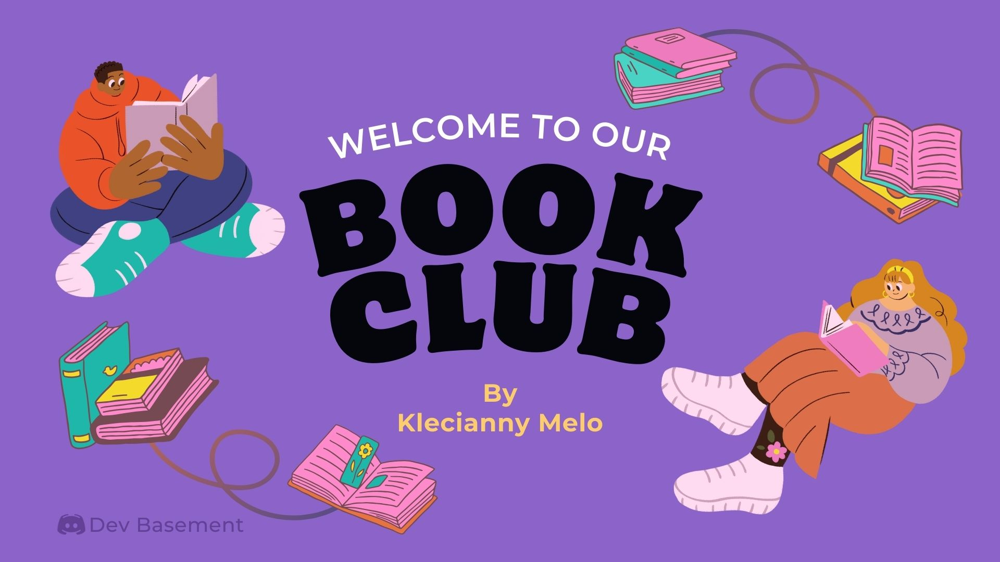

# Book Club - Dev Basement 💜

Repository to document `Book Club` discussions on the `Dev Basement` server.

 

---

## Current Book 📖

The book that is currently being discussed is:

[Craking the Coding Interview](https://www.amazon.com/Cracking-Coding-Interview-Programming-Questions/dp/0984782850)

 

---

## How to participate 🤔

To participate you must be on the [`Dev Basement`](https://dev.to/danielhe4rt/im-creating-a-new-tech-community-42mh) server on Discord.

 

---

## Dating 📆

Meetings take place every `Thursday at 7PM` _(To be defined via form)_. We gathered on the voice channel to share our opinions on the current read.

 

---

## What will you learn 🧠

By participating in the Book Club you will:

- Expand your vocabulary in English;
- Learn and contribute to discussions about the world of technology;
- Being able to contribute to this repository of documentation about the meetings;

Furthermore, you will also increase your network, meeting other developers around the world.

👉🏾 **Let's learn English together and share our opinions about the world of technology!** 💜

 

---

Developed with 🫀 perr<a href="https://www.linkedin.com/in/kecbm/" target="_blank" rel="noopener noreferrer">Klecianny Melo</a> 😁
